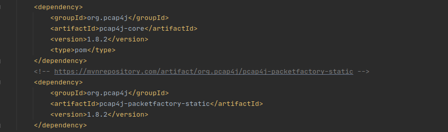
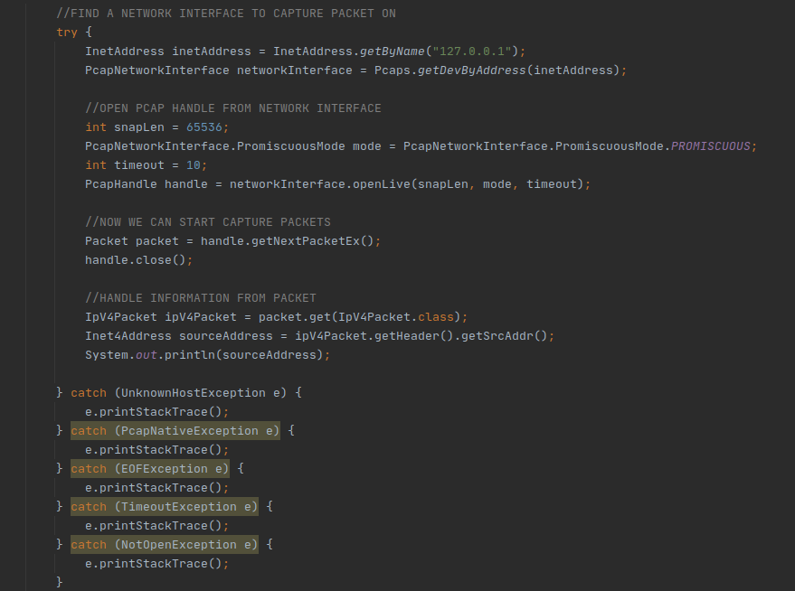

# Pcap4J SET UP GUIDE

Instruction on how to set up Pcap4J for Ubuntu Intellij Maven Project.

### STEP 1: Install Native Library on Ubuntu
Installing libpcap for Ubuntu.

	sudo apt-get install libpcap-dev

### STEP 2: Add capability for Java to allow capture packet
Add capability so that the projects that use the Java version will be able to capture packet.

	sudo setcap cap_net_raw,cap_net_admin=eip path-to-java

You can check it if it has the permission.

	getcap path-to-java
	
### STEP 3: Add dependencies for Java Maven project

Get the dependencies from Maven Central:
	[Pcap4J core](https://mvnrepository.com/artifact/org.pcap4j/pcap4j-core/1.8.2)
	[Pcap4J static packet factory](https://mvnrepository.com/artifact/org.pcap4j/pcap4j-core/1.8.2)
	
### STEP 4: Write first example

1. Find network interface where you want to capture packets
2. Open a pcap handle from the network interface. A pcap handle provides you APIs to capture packets, send packets, and so on.
3. Get a packet using the pcap handle.
4. The packet you captured consists of headers and payloads of some protocols such as Ethernet, IPv4, and TCP. Here shows example of a Ipv4 packet.

#### References

The official Pcap4J website: [Visit Pcap4J website.](https://www.pcap4j.org/)