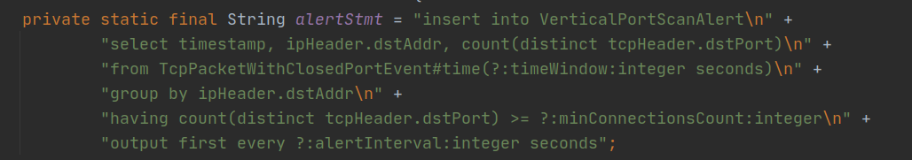
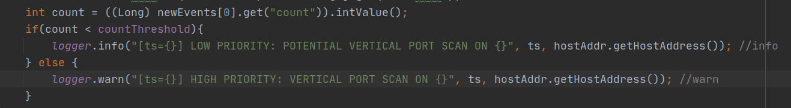

# PRIORITIZE PORT SCANS ALERT DOCUMENT

This document describes the changes made to the system after the implementation the priority of port scans alert.

### THE EPL STATEMENT

Instead of just using count variable output by the runtime for condition to check when to raise the event, the EPL statement has been modified to include count as a variable into the event class itself.

Vertical statement:

The variable count in the statement above the count of number of distinct port being scanned.

### THE LISTENER

The Listener has been modified to have a new Integer value, which is a threshold count that acts like a limit for a warning to be output. This threshold can be changed by the user.

The count above will be used in the Listener class in order to classify low or high priority scan. Using the threshold count above user can choose when will output the high priority alert.

Vertical Listener:
 

### THE MAIN

The PortScansAlertMain main function has been move out into another class, and been given some getters and setters for the user to call and change the parameters to fit their needs.