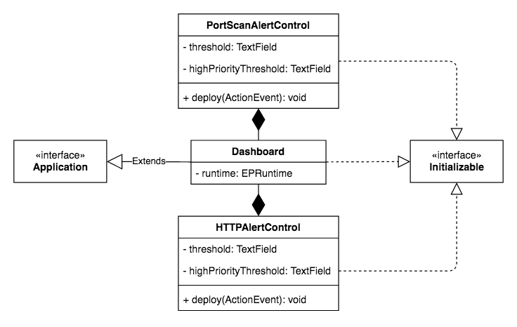

# Sprint review

**Week 2 - Team Jupiter**

+ Bui Xuan Phuoc
+ Dang Chi Cong
+ Pham Nguyen Thanh An
+ Vo Le Tung

---

# Sprint plan

Develop the dashboard for the existing modules, determine if an alert has high or low priority, and research for task 3

**Expected outcome:**

+ Integration of multiple components (each has clearly defined interfaces).
+ The dashboard can show log messages.
+ User can change the parameters for the SIEM system through the dashboard.
+ Determine the additional service/protocol to be monitored by the system.

---

# Sprint backlog

| Status |Subtasks | Story points | Personnel |
|--------|---------|----------------|-----------|
| DONE | Prioritizing HTTP alerts | 50 | Tung |
| DONE | Prioritizing port scan alerts | 50 | An |
| DONE | Bugfix: HTTPAlerts module crashes on certain log message | 100 | Phuoc |
| DONE | ~~Research for alerts that can be raised with DVWA~~ | 100 | Phuoc, Cong |

---

# Sprint backlog

| Status | Subtasks | Story points | Personnel |
|--------|----------|--------------|-----------|
| DONE | Design the dashboard's layout and functionalities | 120 | Tung |
| NOT DONE | Implement the dashboard's functionalities | 140 | Tung, An |
| DONE | ~~Documentation for setting up DVWA~~ | 50 | Cong |

---

# Sprint backlog

| Status | Subtasks | Story points | Personnel |
|--------|----------|--------------|-----------|
| *DONE* | *Research for alerts relating to ARP protocol* | *100* | *Phuoc, Cong* |
| NOT DONE | ~~Research on POP3 brute-force attacks~~ | 100 | Cong |

---

# Changes to the project

+ Remove alerts for consecutive large files send.
+ Add a simple dashboard that can make changes to the system.
+ Add abilities to report alerts with different priority to listeners.

---

# Plans for next week

*Sprint planning:*

+ Making the dashboard able to show the alerts.
+ Implements task 3 and integrates it with the dashboard.
+ Provide documentation for the project.

---

# ARP alerts


---

# ARP alerts

* `ARPMultipleUnaskedForAnnouncementAlert`: Multiple gratuitous ARP announcement is detected in a time frame.
* `ARPDuplicateIPAlert`: One IP is mapped to multiple MAC addresses in ARP cache.
* `ARPCacheFloodAlert`: ARP cache has too many entries.

---

# ARP alerts

```java
public class ARPPacketEvent {
    String srcIP;
    String destIP;
    String srcMAC;
    String destMAC;
    boolean isReply;
    boolean isAnnouncement;
    String time;

    /* ... */
}
```

---

# Prioritizing existing alerts

```java
Long count = (Long) newEvents[0].get("failuresCount");

if (count < highPriorityThreshold) {
    log.info("LOW PRIORITY");
} else {
    log.warn("HIGH PRIORITY");
}
```

---

# SIEM dashboard

**JavaFX 15**



---

# SIEM dashboard

```java
Configuration config = new Configuration();

Properties httpAlertsProps = new Properties();
httpAlertsProps.put(HTTPAlertsPlugin.RUNTIME_URI_KEY, "HTTPAlertsPlugin");
httpAlertsProps.put(HTTPAlertsPlugin.LOG_PATH_KEY, "/var/log/apache2/access.log");

config.getRuntime().addPluginLoader(
        "HTTPAlertsPlugin",
        "vn.edu.vgu.jupiter.http_alerts.HTTPAlertsPlugin",
        httpAlertsProps);

runtime = EPRuntimeProvider.getRuntime("SIEM", config);
```

---

# SIEM dashboard

```java
@Override
public void initialize(URL url, ResourceBundle resourceBundle) {
    this.httpAlertControlPanelController.setRuntime(runtime);
}


@FXML
public void deploy(ActionEvent actionEvent) throws NamingException, EPUndeployException {
    HTTPAlertsPlugin plugin =
        (HTTPAlertsPlugin) runtime
            .getContext()
            .getEnvironment()
            .get("plugin-loader/HTTPAlertsPlugin");

    plugin.undeploy();
    plugin.deploy(new HTTPAlertsConfiguration());
}
```

---

# System design


---

# Port scan alerts: Events hierarchy

```text
                                 |--> VerticalScanAlert
                                 |
TcpPacket --> TcpToClosedPort -->|--> HorizontalScanAlert
                                 |
                                 |--> ClosedPortsPerAddr --> BlockScanAlert
```

---

# HTTP service alerts: Events hierarchy

```text
                                httpLogEvent
                                     |
                                     |
                                     v
ConsecutiveSameUserID <-- httpFailedLoginEvent --> ConsecutiveFromSameIP
                                     |
                                     |
                                     v
                             ConsecutiveFailures
```