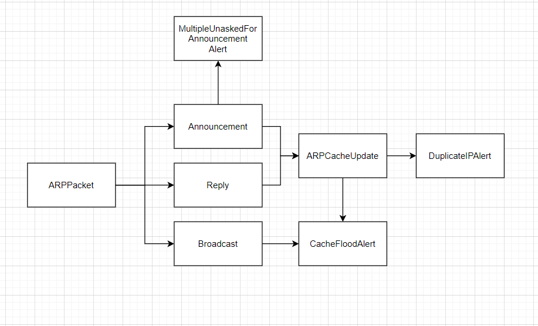

# ARP related attacks

## ARP Spoofing (ARP cache poisoning)
* An ARP spoofing, also known as ARP poisoning, is a Man in the Middle (MitM) attack that allows attackers to intercept communication between network devices

## ARP cache flooding (MAC flooding)
* MAC flooding works by forcing legitimate MAC table contents out of the switch and forcing a unicast flooding behavior potentially sending sensitive information to portions of the network where it is not normally intended to go
* The intention is to consume the limited memory set aside in the switch to store the MAC address table.
* The desired effect (by the attacker) is to force legitimate MAC addresses out of the MAC address table, causing significant quantities of incoming frames to be flooded out on all ports.
# ARP event hierarchy


# ARP event beans classes in Java

## ARPPacketEvent class
* Is raised whenever a packet of type ARP is detected.
* Is captured in Java with Pcap4j.


* All attributes were derived from the packet's header except for the "time" attribute which should be generated using Java by the time the Object is created.

## Event classes without listeners
* ARPAnnouncementEvent: A gratuitous announcement packet is detected.
* ARPReplyEvent: A reply packet to a previous broadcast packet is detected.
* ARPBroadcastEvent: A broadcast packet targeting every machine in the network is detected. 
* ARPCacheUpdate: Derived from the reply and announcement events, simulating an arp cache in Java itself.

## Event classes with listeners
* These are alerts events, listeners usually are usually are logging functions.
* MultipleUnaskedForAnnouncement: When a surge of gratuitous announcements are detected in a time frame.
* CacheFloodAlert: When an attempt to flood the MAC table is detected.
* DuplicateIP: When one IP address is being mapped to multiple MAC addresses.

# Demonstration
* Before proceeding, the linux system should have installed net-tools and dsniff with the following command:
```
sudo apt-get install net-tools
```  
```
sudo apt-get install dsniff
```

* Turn on packets forwarding in linux:
```
sysctl -w net.ipv4.ip_forward=1
```

## ARP Spoofing
* A DuplicateIP alert should be raised.
* To arpspoof a target:
```
arpspoof -i [Network Interface Name] -t [Victim IP] [Router IP]
```
or if we want to intercept packages from the router use:
```
arpspoof -i [Network Interface Name] -t [Router IP] [Victim IP]
```

## MAC Cache Flooding
* A CacheFlood alert should be raised.
* To MAC flood a target:
```
macof -i [Network Interface Name] -n [Number of time] -d [Target IP]
```
* -d target IP field is optional.
* -n number of time field can be left blank if we want to MAC spoof the interface with no attempt limit.

## Multiple gratuitous announcement
* A MultipleUnaskedForAnnouncement alert should be raised.
* To send ARP announcements:
```
arping -U [IP to announce for]
```
If we want to spoof an address, first run: 
```
echo 1 > /proc/sys/net/ipv4/ip_nonlocal_bind
```