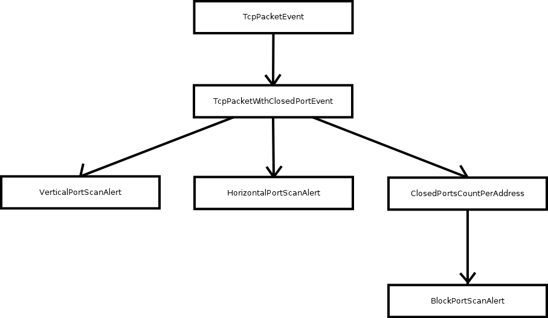

## Port scans alert

### Introduction

Port scan is a process of sending connection requests to a large range of port addresses on a host to find an active port. Port scan gives back information of the host services and may be the begining of a actual attack.

#### Types of port scans

There are several types of port scans, but three are introduced and made alert in this SIEM system.

+ Vertical port scans: several ports are scanned on an address of the host.
+ Horizontal port scans: several addresses are scanned on a certain port.
+ Block port scans: the combination of vertical and horizontal port scans, basically several ports are scanned on several addresses.

### Port scans Event Hierarchy

+ The diagram describes the event hierarchy that is used to alert users of three potential Port Scans that can happen in the network. The events in the diagram are:
    + TcpPacketEvent: the raw event that is produced whenever a network packet that uses TCP protocol is captured.
    + TcpPacketWithClosedPortEvent: the event that is produced whenever a host is trying to send TCP packets to a closed port on another host.
    + ClosedPortsCountPerAddress: the event is raised by pairing a destination address with the number of connections to a closed port on that address.

+ The alert events in the diagram are:
    + VerticalPortScanAlert: the alert event. When there are a number of TcpPacketWithClosedPort objects that has the same destination address and if their total number of distinct port exceeds the threshold, all of this happens in a certain time frame, then the event is raised.
    + HorizontalPortScanAlert: the alert event. When there are a number of TcpPacketWithClosedPort objects that has the same destination port and if their total number of distinct address exceeds the threshold, all of this happens in a certain time frame, then the event is raised.
    + BlockPortScanAlert: the alert event is raised when the number of hosts, whose closed ports were accessed for more times than a given threshold, exceeds its limit.