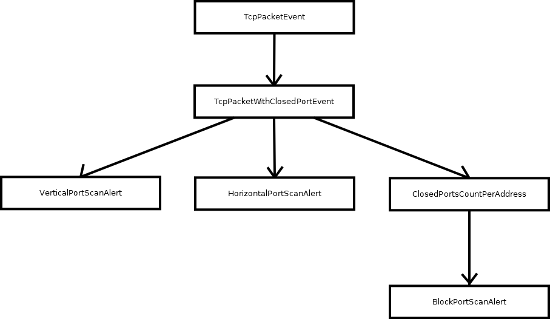

# A CEP-based SIEM System (Jupiter)

+ Bui Xuan Phuoc
+ Dang Chi Cong
+ Pham Nguyen Thanh An
+ Vo Le Tung

---

# Overview: Security information and event management

+ Collect and aggregate data:
    + Data comes from multiple sources.
    + Normalise the data.
+ Provide analysis and reporting of data.
+ Monitor:
    + Cross correlation.
    + Provide notification.

---

# Overview: Complex event processing

+ Events stream processing
+ Infer *complex* events based on other events
    + Pattern detection
    + Filter
    + Aggregation
    + etc.

---

# Overview: Complex event processing

**E.g.:**

1. Puts hands to mouth.
2. Turns head towards mom’s breast or bottle.
3. Puckers, smacks, or licks lips.
3. Has clenched hands.

=> Baby is hungry

[(https://www.cdc.gov/nutrition/InfantandToddlerNutrition/mealtime/signs-your-child-is-hungry-or-full.html)](https://www.cdc.gov/nutrition/InfantandToddlerNutrition/mealtime/signs-your-child-is-hungry-or-full.html)

---

# Our SIEM system

---

# Our SIEM system: HTTP service alert

---

# Our SIEM system: Port scan alert

---

# Our SIEM system: ARP alert

---

# Our SIEM system: What can be improved?

+ Structured log message
+ Microservices architecture
+ Consider multiple sources of event for each alert
+ More noticable alerts
+ Smooth GUI

---

# Demo: Our web service

---

# Demo: Tools used

+ `nmap` [(https://nmap.org)](https://nmap.org)
+ `macof` [(https://linux.die.net/man/8/macof)](https://linux.die.net/man/8/macof)
+ `arping` [(https://linux.die.net/man/8/arping)](https://linux.die.net/man/8/arping)
+ `arpspoof` [(https://linux.die.net/man/8/arpspoof)](https://linux.die.net/man/8/arpspoof)